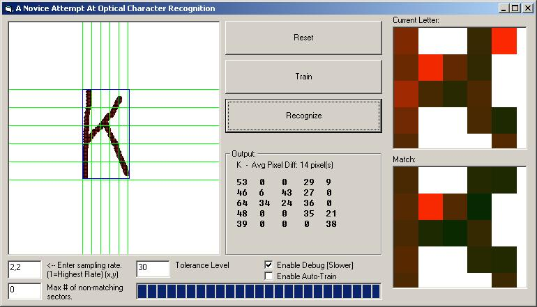



## OCR Analyzer

### Description

Attempts Handwritten Optical Character Recognition. (And does a good job at it)
 
### More Info
 
It's possible to specify Tolerance Level, Sampling Rate, and Max # of bad sectors for letters to be considered a match. (See read-me file in archive)

The default settings work the best.

Returns a typed letter based on what the user draws.

             |
---                |---
**Submitted On**   |2003-09-15 13:18:50
**By**             |[Nelson T](https://github.com/Planet-Source-Code/PSCIndex/blob/master/ByAuthor/nelson-t.md)
**Level**          |Intermediate
**User Rating**    |4.9 (113 globes from 23 users)
**Compatibility**  |VB 6\.0
**Category**       |[Graphics](https://github.com/Planet-Source-Code/PSCIndex/blob/master/ByCategory/graphics__1-46.md)
**World**          |[Visual Basic](https://github.com/Planet-Source-Code/PSCIndex/blob/master/ByWorld/visual-basic.md)
**Archive File**   |[OCR\_Analyz1645759152003\.zip](https://github.com/Planet-Source-Code/nelson-t-ocr-analyzer__1-48515/archive/master.zip)

